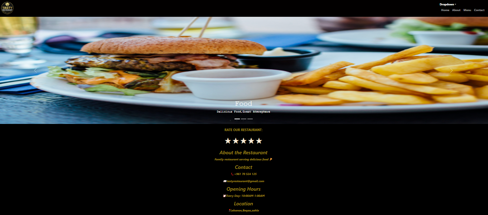
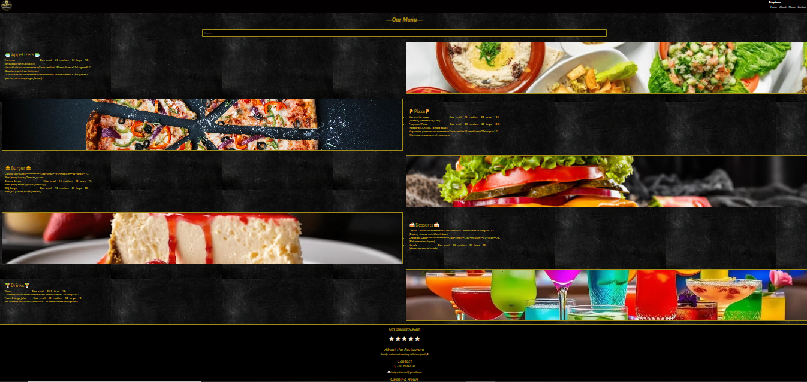
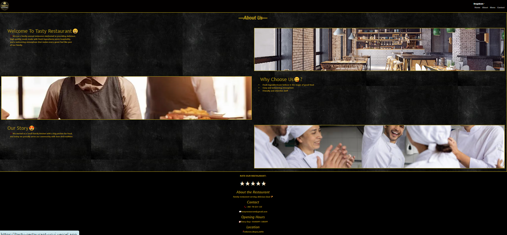
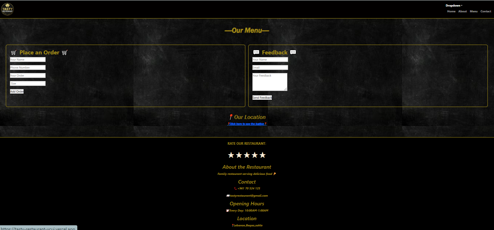

 # Tasty Restaurant 🍕

## Description
Tasty Restaurant is a family-owned restaurant website built with ReactJS that allows users to browse the menu, place orders, and leave feedback.

## Features
- Home page with image carousel
- Menu page with search functionality
- About page
- Contact page with order form and feedback
- Rating system
- Back to top button
- Responsive design

## Technologies Used
- ReactJS
- Bootstrap 5
- React Router DOM
- CSS3

## Setup Instructions
1. Clone the repository
2. Run npm install
3. Run npm start

## Live Demo
[tasty-restaurant-ycuj.vercel.app](https://tasty-restaurant-ycuj.vercel.app)

## Screenshots

### Home Page

### Menu Page

### About Page

### Contact Page

